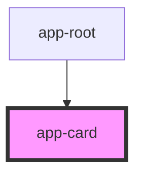

# app-card

<!-- Auto Generated Below -->

## Properties

| Property             | Attribute | Description | Type     | Default     |
| -------------------- | --------- | ----------- | -------- | ----------- |
| `index` _(required)_ | `index`   |             | `number` | `undefined` |

## Dependencies

### Used by

 - [app-root](../app-root)

### Graph

----------------------------------------------

*Built with [StencilJS](https://stenciljs.com/)*
